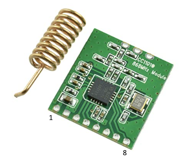
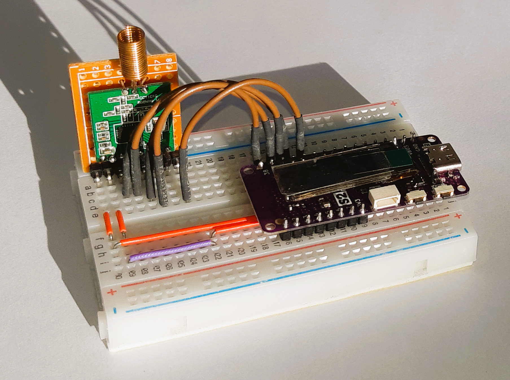

# ITHO CVE controller in MicroPython

## Problem

At home, I've got an ITHO CVE central ventilation unit with builtin humidity and CO2 sensor. However, these sensors only work when the CVE is set to Auto mode. In this mode the fans runs at medium speed. At night this is not needed and also the fan is too noisy for me. So I wanted to be able to switch the CVE to low speed around 23:00 hrs, and return to auto mode early in the morning.

An excellent job for a microcontroller. Many enthusiast have developed hardware and software to control an ITHO CVE. However, most code is written in C, and I use microcontrollers running MicroPython. So, I converted these C libraries into MicroPython versions. Of course that was the easy part. All credits go to the developers of these C libraries for their research in the communication protocol ITHO uses.

## Hardware

Aside from a microcontroller - for this project I'm using a [Wemos S2 Pico](https://www.wemos.cc/en/latest/s2/s2_pico.html) - the only hardware required is a [CC1101](https://www.bitsandparts.nl/RF-Transceiver-868MHz-CC1101-met-antenne-p1105676). This is a 868 MHz transceiver module which communicates with the CVE. The table below indicates how to connect these two components together.



**Pinout**

| CC1101 | Wemos S2 Pico |     |
| ------ | ------------- | --- |
| 1 VCC  | 3V3 |
| 2 GND  | GND |
| 3 MOSI | P35 |
| 4 SCK	 | P37 |
| 5 MISO | P36 |
| 6 GD02 | P38 | General IO pin, indicates CC1101 is receiving a message
| 7 GD00 | -   | Unused
| 8 SS	 | P34 | Chip select a.k.a slave select

The picture shows my actual setup using a breadboard. Note that I've made a carrier board for the CC1101 module as its pin pitch is smaller than the 1.27mm used on the breadboard. The nice thing about using a Wemos S2 Pico is that it can be connected to an USB C cable for power. It also has a small 132x32 OLED screen which I'm not using here.



## Software

### CC1101 driver

File *cc1101.py* contains the CC1101 driver. It is inspired by various versions written in C which can be found on GitHub. See the file header for the specific repositories I used. I tried to copy as much comments from the original libraries as possible. This version does nothing new, only difference is it is coded in MicroPython. The relevant aspects of your microcontrollers and hardware design must be recorded in *config.py*. The code in the driver itself is hardware and design agnostic. The code on GitHub assumes you are using the hardware as specified in the previous paragraph. By running just *cc1101.py* by itself the connection to the CC1101 module is tested. Output like this will appear:

    Status byte 0x3d 0b111101
    VERSION 0x14
    0x29 0x2e 0x3f
    0x29 0x2e 0x3f

### ITHO contoller

The actual controller for the ITHO CVE can be found in *itho.py*. It is a MicroPython version from [letscontrolit/ESPEasyPluginPlayground](https://github.com/letscontrolit/ESPEasyPluginPlayground/tree/master/libraries%20_PLUGIN145%20ITHO%20FAN/Itho) which in turn is based on the code from [Arjen Hiemstra](https://github.com/arjenhiemstra). Functionally the controller matches the works mentioned above.
As with the driver for the CC1101 all configuration must be done in *config.py*. Initially you won't be aware of your device type and device id to use. These can be discovered by running *itho.py* and pressing the buttons on your physical ITHO remote. Output such as below will appear when for example the Auto button is pressed:

    listening to remote commands

    packet 1
    device type 22
    device id 116 233 94
        command 4
        bytes 34 241 3 99 3 4
    bytes chk 34 241 3 99 3 4
        counter 83

This information can then be used to fill *config.py*.

### Main program

The main program is based on asyncio which makes it easy to execute multiple tasks. It can be found in *controller.py*.

The core function is *scheduler* which wakes up every minute to see if commands need to be sent to the CVE. Also, as the scheduler is dependent on the correct time, and I am not sure what the accuracy of the ESP32S2's internal clock is once per 24 hrs this clock is synchronized with a ntp server (see *ntp.py*).

A small web user-interface is included based on [ahttpserver](https://github.com/erikdelange/MicroPython-HTTP-Server). This can be used to manually control the CVE but also to set the time when the CVE must be switched to low speed and when back to medium speed. In the current implementation these times are not recorded in non-volatile memory, so if you decide to deviate from the hardcoded moments after every reset or power cycle they have to be re-entered.


The three panels on the UI are collapsable (accordions). The bottom one is normally collapsed.

For debug purposes the webserver can be stopped by calling *IP address of your microcontroller*:80/api/stop or by pressing the separate button on the Wemos board. If you are using a different board then the Wemos S2 Pico remove the following line from *contoller.py*:

```python
import s2pico
```
Module s2pico contains definitions for the specific hardware an S2 Pico has (button, led, OLED). The cool thing is that this module is included in the MicroPython version for the S2 Pico.

Also, in the line below replace *s2pico.button* with *machine.Pin(pin number for button on your board)*

```python
pb = abutton.Pushbutton(s2pico.button, suppress=True)
```

Debugging is also the reason why the code in *controller.py* is not included in *main.py* (making *controller.py* superfluous). During development *main.py* is set up in such a way that the controller is not started automatically. I'm using Thonny as IDE and by first connecting to the Wemos board you get a shell prompt. From this prompt I start the controller by *import controller*. In that way error or debugging messages are captured by the shell.

### Additional modules needed

Also copy [ahttpserver](https://github.com/erikdelange/MicroPython-HTTP-Server), [uftpd.py](https://github.com/robert-hh/FTP-Server-for-ESP8266-ESP32-and-PYBD/blob/master/uftpd.py) and [abutton.py](https://github.com/kevinkk525/pysmartnode/blob/master/pysmartnode/utils/abutton.py) to your microcontroller. The code of these modules is not included in this repository. Stricly speaking uftpd.py is not neccesary, however I find it handy to be able to move files to the microcontroller using the FileZilla FTP client.
